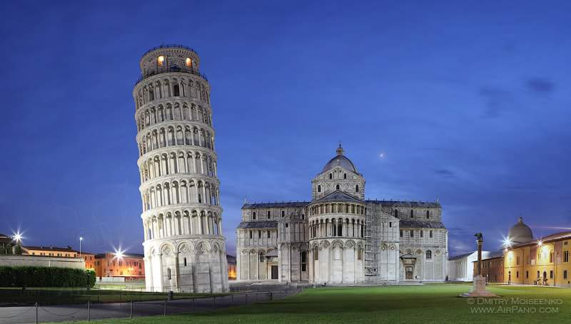
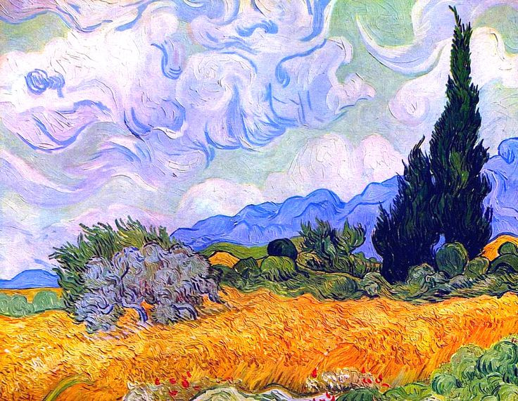
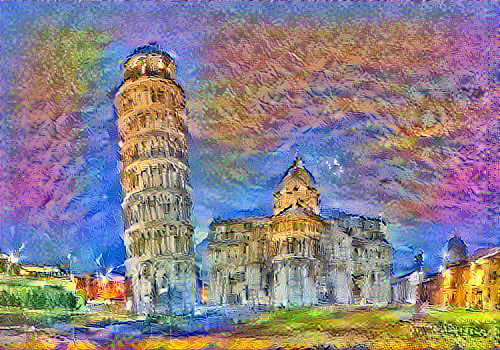
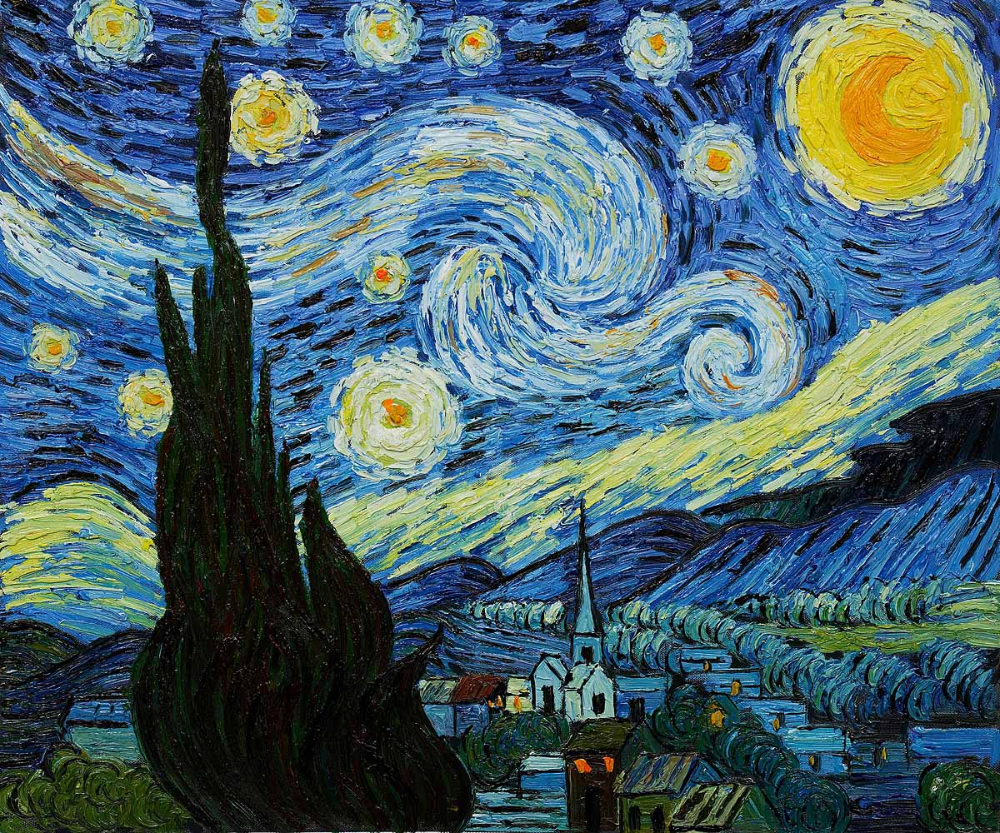
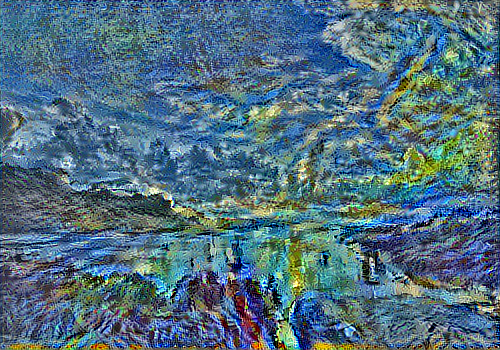
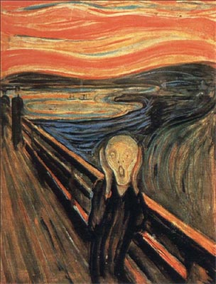

I always wanted to be a great painter, able to beautifully mix colors and shapes and create works of art that would mesmerize people. But I was never good enough, so I am writing this post instead. One of the many things about art, and in particular paintings, that always fascinated me is the striking balance between style and substance, technique and content that talented artists apparently seamlessly achieve in their work. One, in fact, can be able to exactly replicate objects or shapes, but it is the fashion in which this is done that utlimately makes the difference between a nice picture and a great work of art. But while it is fairly easy to spot a Monet from a Raffaello, it is not trivial to identify the line that separating "style" from the "content" of a picture or image. Well, until this <a href="https://arxiv.org/pdf/1508.06576.pdf" >paper</a> came about, showing that style and content are, in fact, separable, and illustrating the procedure to tell a machine to do it for you.

To this aim, I train a Convolutional Neural Network (CNN) to perform the task of exctracting the style from an image of choice and applying it to another image (of choice as well). The original implementation, which is here reproduced with minor modifications, can be found in the original <a href="https://arxiv.org/pdf/1508.06576.pdf" >paper</a>. For a great overview of the underlying principles of Neural Style Ttransfer (NST) (and beyond!), I highly recommend the excellent fat.ai <a href="http://www.fast.ai">MOOC</a> by Jeremy Howard, as well as the <a href="https://github.com/titu1994/Neural-Style-Transfer"> Neural-Style-Transfer</a> GitHub repository.

This document is organized as follows:
  - Overview
  - Data Loading and Preprocessing
  - Style Transfer Procedure
    - Building the CNN
    - Defining the Loss Function
      - Content Loss
      - Style Loss
      - Total Loss
    - Retrieve CNN Layers and Targets
    - Define the Solver
    - Applying the Transfer
  - Results
  - Appendix

The post is intended as a walkthrough of the methodology and provides a complete codebase to implement your own NST model.


## Overview

NST is based on the principle that CNNs trained on object recognition store image information along their hierarchical architecture in a fashion that is increasingly "explicit". The latter means that, as one goes deeper into the network, the activation layers go from recognizing simple patterns, such as lines or edge/color conjunctions to capturing the more complex shapes that allow discrimination between objects, as brilliantly illustrated in this pioneering <a href="https://arxiv.org/pdf/1311.2901v3.pdf"> paper</a>.

The above principle means that a CNN increasingly cares about the "content" of an image the more deeply one gets into the network, while the higher level patterns that make up the "style" of the image are "somewhat" stored (some additional processing is actually required to retrieve the style, as discussed more in depth later) in the more superficial layers. Therefore, style and content information could be "lifted" from the superficial and the deeper layers, respectively, of a CNN, then combined and applied back to a "virgin" image, which will be the representation of the content image in the style of the style image.

The practical procedure to achive the style transfer is the following:
 - Build a CNN. VGG16 with pretrained ImageNet weight is the model of choice.
 - Have the content image pass through the network and store the output at some deep layer(s). This would constitute the "target content".
 - Have the style image pass through the network and store the output at some superficial layer(s). This would constitute the "target style".
 - Define an appropriate loss metric (e.g. MSE).
 - Have a new "virgin" (i.e. random noise) image pass through the network and compute the content loss and the style loss of this image, using the output of the CNN at the content layer(s) and style layer(s), respectively.
 - Instead of updating the weights of the CNN, update the image pixels in order to iteratively minimize the loss between the image and the style and content targets.

The NST will be implemented in Keras (version 2.0.4) with Tensorflow backend (although it should work in Theano without modifications). Notice that, while Keras can be used on top of its supported backends for most applications without explicitly call the backend itself, NST implementation requires an ad-hoc optimization procedure which is not supported natively by Keras API. Therefore, Keras backend will be explicitly called in several occasions to allow for the symbolic definition of the functional graph.

## Data Loading and Preprocessing

A simple implementation of NST only requires loading one content image and one style image. However, a little preprocessing is necessary in order to make the source images compatible with each other and with the architecture of the the underlying CNN. Here, I use VGG16, which comes right out of the box with pre-trained weights from Keras. To use VGG effectively for transfer learning, the pixel values of the input images need to be shifted by the average value of ImageNet image channels (because that is how VGG was trained in the first place). Here are two functions that do the pre-process and post-process.

```python
def image_preprocess(img_ar):
    '''
    Input: image as numpy array
    Output: preprocessed image as numpy array
    '''
    resnet_mean = np.array([123.68, 116.779, 103.939], dtype=np.float32)
    exp_img_ar = np.expand_dims(np.array(img_ar), 0)
    proc_img_ar = (exp_img_ar - resnet_mean)[:,:,:,::-1]
    return proc_img_ar
#end

def image_postprocess(img_ar, shp):
    '''Input: preprocessed image as numpy array
       Output: postprocessed image as numpy array
    '''
    resnet_mean = np.array([123.68, 116.779, 103.939], dtype=np.float32)
    postpr_img_ar = np.clip(img_ar.reshape(shp)[:,:,:,::-1] + resnet_mean, 0, 255)
    return postpr_img_ar
#end
```

In addition to image processing, one has to make sure that style and content images have the same resolution when they are loaded and converted to numpy arrays.

```python
path = './'
resize_to = (500, 350)

vangogh_style = Image.open(path + 'van_gogh_02.jpg').resize(resize_to)
leaningtower_content = Image.open(path + 'leaning_tower.jpg').resize(resize_to)

vangogh_style_ar = image_preprocess(vangogh_style)
leaningtower_content_ar = image_preprocess(leaningtower_content)

shp = vangogh_style_ar.shape
```

## Style Transfer Procedure

### Building the CNN

The first step to build a NST algorithm is to define the CNN. Here, I will be using VGG16, as suggested in the original style transfer <a href="https://arxiv.org/pdf/1508.06576.pdf" >paper</a>, with the modification of substituting the MaxPooling layers with AveragePooling ones, in an attempt not to lose much information (although there are instances where MaxPooling appears to produce better results, as discussed <a href="https://github.com/titu1994/Neural-Style-Transfer">here</a>).

Here is a function that modifies VGG16 with AvgPooling layers:

```python
def vgg_avgpooling(vgg_model):
    vgg_avg_model = Sequential()
    for i, layer in enumerate(vgg_model.layers):
        name = layer.name
        if type(layer)!=MaxPooling2D:
            vgg_avg_model.add(layer)
        else:
            vgg_avg_model.add(AveragePooling2D((2, 2), strides=(2, 2), name=name[0:6] + '_avgpool'))
        #end
    #end
    return vgg_avg_model
#end
```

### Defining the Loss Function

Style transfer is achieved iteratively by minimizing a loss function between the computed image and the content target and the style target. Separate loss functions are defined for style and content and then combined linearly together to produce the total loss to be minimized.

To this aim, Keras backend will be called and used to build the computational graph. 

#### Content Loss

The content loss function is defined simply as the Mean Squared Error (MSE) between the target and the computed tensor(s) extracted at the content layer(s). While, in principle, there could be more than one content layer (e.g. two or more convolutional layers in VGG16 block 4 or 5), here the output tensor of "block4conv2" layer is used.

```python
def content_loss(computed, target, weight_ls=None):
    '''
    Input: computed and target tensors (or lists of tensors for more than one content layer)
    Output: content loss calculated as MSE and scaled by the tensor(s) dimension
    '''
    if isinstance(computed, list):
        if not weight_ls:
            weight_ls = [1.0 for layer in computed]
        #end
        c_loss = sum([K.sum(metrics.mse(comp[0], targ[0]) * w \
                      for comp, targ, w in zip(computed, target, weight_ls))])
        _, height, width, channels = map(lambda i: i, K.int_shape(computed[0]))
    else:
        c_loss = K.sum(metrics.mse(computed, target))
        _, height, width, channels = K.int_shape(computed)
    #end
    c_loss = c_loss / (height * width * channels)
    return c_loss
#end
```

#### Style Loss

The style loss function is similar to the content loss function in that a MSE loss is also used. However, the extraction of the style from the style layer(s) requires the tensors to undergo a first step of pre-processing. Specifically, the MSE is applied to the Gram matrix of the style tensors. The conceptual reason why the Gram transformation is necessary is still subject of debate, but intuitively it can be seen as a way to capture features that tend to activate together (by correlating channels to each other), while discarding most of the spatial information.

```python

def gram_matrix(tens):
    features = K.batch_flatten(K.permute_dimensions(tens, (2, 0, 1))) # rows = channels, columns = flattened x, y
    gram = K.dot(features, K.transpose(features)) / tens.get_shape().num_elements() #correlate each pair of channels
    return gram
#end

def style_loss(computed, target, weight_ls=None):
    '''
    Input: computed and target tensors (or lists of tensors for more than one style layer)
    Output: content loss calculated as MSE of the Gram matrices and scaled by the tensor(s) dimension
    '''
    if isinstance(computed, list):
        if not weight_ls:
            weight_ls = [1.0 for layer in computed]
        #end
        s_loss = sum([K.sum(metrics.mse(gram_matrix(comp[0]), gram_matrix(targ[0]))) * w \
                      for comp, targ, w in zip(computed, target, weight_ls)])
        _, height, width, channels = map(lambda i: i, K.int_shape(computed[0]))
    else:
        s_loss = K.sum(metrics.mse(gram_matrix(computed), gram_matrix(target)))
        _, height, width, channels = K.int_shape(computed)
    #end
    s_loss = s_loss / (height * width * channels)
    return s_loss
#end
```

#### Total Loss

The total loss is simply a linear combination of the style and content losses. Notice that, in addition to the target tensors, the loss takes the tensors of the content and style layers as input in their symbolic form (i.e. nothing is explictly passed to these variables until the iterative phase).

```python
def total_loss(style_layer_ls, style_targ_ls, style_wgt_ls, content_layer, content_targ, style2content_ratio):
    s_loss = style_loss(style_layer_ls, style_targ_ls, style_wgt_ls)
    c_loss = content_loss(content_layer, content_targ)
    loss = s_loss + c_loss / style2content_ratio
    return loss
#end
```

### Retrieve Layers and Targets

In this part, I define two functions that take the style transfer model as input and, respectively, the style image and the content image as numpy arrays, and return the target layers and their symbolic counterparts extracted from the image that will be iteratively produced.

```python
def get_content_targets(style_transfer_model, content_ar):
    '''
    Input: style transfer model and numpy array of the content image
    Output: the output of the model at the content layer and its respective target
    '''
    layer_output_dc = {l.name: l.get_output_at(0) for l in style_transfer_model.layers}
    content_layer = layer_output_dc['block4_conv2'] #change it to another layer of choice if necessary
    content_model = Model(style_transfer_model.input, content_layer)
    content_targ = K.variable(content_model.predict(content_ar))
    return content_layer, content_targ
#end 

def get_style_targets(style_transfer_model, style_ar):
    '''Input: style transfer model and numpy array of the style image
       Output: the output of the model at the style layer(s) and its respective target
    '''
    layer_output_dc = {l.name: l.get_output_at(0) for l in style_transfer_model.layers}
    style_layer_ls = [layer_output_dc['block{}_conv2'.format(o)] for o in range(1,6)] #change it different layers if necessary
    style_model = Model(style_transfer_model.input, style_layer_ls)
    style_targ_ls = [K.variable(o) for o in style_model.predict(style_ar)]
    return style_layer_ls, style_targ_ls
#end 
```

### Define the Solver

This step requires a function that iteratively updates our "virgin" image using some optimization procedure (here I use the scipy BFGS optimizer), as well as an evaluation object that returns the loss function and the gradients to be fed back to the optimizer.


```python

class Evaluator(object):
    '''
    Initialization: function and shape of the image array
    Returns the loss and the gradients as computed with
       respect to the image that is fed to the CNN
    '''
    def __init__(self, f, shp):
        self.f = f
        self.shp = shp
        return
    #end        
    def loss(self, x):
        loss_, self.grad_values = self.f([x.reshape(self.shp)])
        return loss_.astype(np.float64)
    #end
    def grads(self, x): 
        return self.grad_values.flatten().astype(np.float64)
    #end    
#end

def apply_transfer(eval_obj, n_iter, img, shp, path='./', pref='', save=True, verbose=True):
    '''
    Input: evaluator, number of iterations, input image and shape
    Output: final image, list of losses and info dictionary of optimization procedure
    '''
    info_dc = dict()
    loss_ls = list()
    for it in range(n_iter):
        img, min_val, iter_dc = fmin_l_bfgs_b(eval_obj.loss, img.flatten(),
                                              fprime=eval_obj.grads, maxfun=20)
        img = np.clip(img, -127, 127)
        info_dc['iteration_'+str(it+1)] = iter_dc
        loss_ls = loss_ls + [min_val]
        if verbose:
            print('Current loss value:', min_val)
        #end
        if save:
            imsave(path + pref + 'res_at_iteration_' + str(it+1) + '.png', image_postprocess(img.copy(), shp)[0])
        #end
    #end
    return img, loss_ls, info_dc
#end
```

### Applying the Transfer

Here is the last step, that is, putting everything together and iteratively building an image that combines the style of the style image with the content of the content image.

For this step, it is necessary to define the number of iterations (no recipe for it, just enough so that the model converges), the ratio between content and style in the image, the weights to be applied to each style (and/or content) layer and a set of objects necessary to feed the optimizer. Then, the model is ready to run!

```python

iterations = 10

st_transf_model = vgg_avgpooling(VGG16(include_top=False, input_shape=shp[1:]))

content_layer, content_targ = get_content_targets(st_transf_model, leaningtower_content_ar)
style_layer_ls, style_targ_ls = get_style_targets(st_transf_model, vangogh_style_ar)

style_wgt_ls = [0.05,0.2,0.2,0.25,0.3]
style2content_ratio = 15.0
loss = total_loss(style_layer_ls, style_targ_ls, style_wgt_ls, content_layer, content_targ, style2content_ratio)
grads = K.gradients(loss, st_transf_model.input)
transfer_fn = K.function([st_transf_model.input], [loss] + grads)
evaluator = Evaluator(transfer_fn, shp)

virgin_img = np.random.uniform(-2.5, 2.5, shp)/100

image, t_loss, info_dc = apply_transfer(evaluator, iterations, virgin_img, shp, path=path)
```

## Results
Here are some results. There is room for improvement but the combined images are already remarkable. Well, at least in my opinion. Playing with style to content ratio, weights to be assigned to the extracted style layers, as well as with the color scheme or through image masking can result in a variety of visual effects.

<div id="image-table">
    <table>
        <tr>
            <td style="padding:10px">
                <h4> Content Image </h4>
                
              </td>
            <td style="padding:10px">
                <h4> Style Image </h4>
                
             </td>
            <td style="padding:10px">
                <h4> Style Transfer </h4>
                
             </td>
        </tr>
    </table>
</div>

<div id="image-table">
    <table>
        <tr>
            <td style="padding:10px">
                <h4> Content Image </h4>
                
              </td>
            <td style="padding:10px">
                <h4> Style Image </h4>
                
             </td>
            <td style="padding:10px">
                <h4> Style Transfer </h4>
                
             </td>
        </tr>
    </table>
</div>

<div id="image-table">
    <table>
        <tr>
            <td style="padding:10px">
                <h4> Content Image </h4>
                
              </td>
            <td style="padding:10px">
                <h4> Style Image </h4>
                
             </td>
            <td style="padding:10px">
                <h4> Style Transfer </h4>
                
             </td>
        </tr>
    </table>
</div>

## Appendix

### Imported Libraries

```python
import math
import keras
import numpy as np
import keras.backend as K
import matplotlib.pyplot as plt
import random
import os
from scipy.optimize import fmin_l_bfgs_b
from scipy.misc import imsave
from PIL import Image
from keras import metrics
from keras.applications.vgg16 import VGG16
from keras.preprocessing import image
from keras.models import Model, Sequential
from keras.layers import *
from keras.optimizers import Adam
from keras.regularizers import l2
```